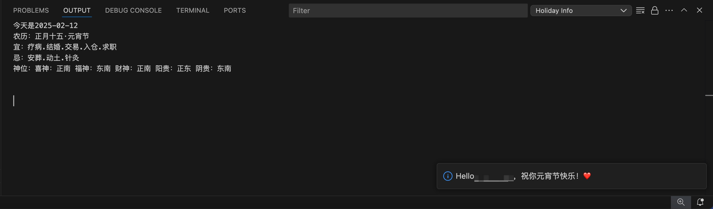

# zaoshuizaoqi

Hello "ZaoShuiZaoQi". 

Command: `ZaoShuiZaoQi`

### Version

## Features

- Holiday wishes.
- Festival info.

## Installation

1. Open Visual Studio Code.
2. Go to the Extensions view by clicking the Extensions icon in the Activity Bar on the side of the window.
3. Search for `ZaoShuiZaoQi`.
4. Click Install.

## Usage

1. Open a file in Visual Studio Code.
2. Press `Ctrl+Shift+P` to open the Command Palette.
3. Type `Your Command` and select it from the list.

## Preview

## Contributing

If you would like to contribute, please fork the repository and submit a pull request.

## License
This extension is licensed under the xxxx.

**Enjoy!**